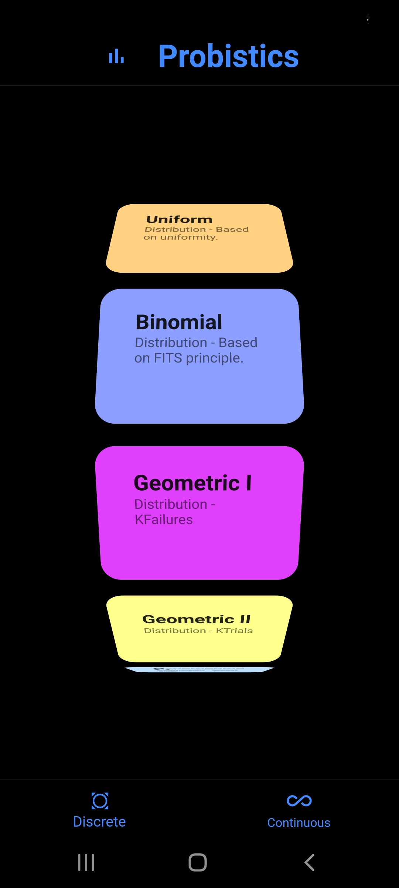
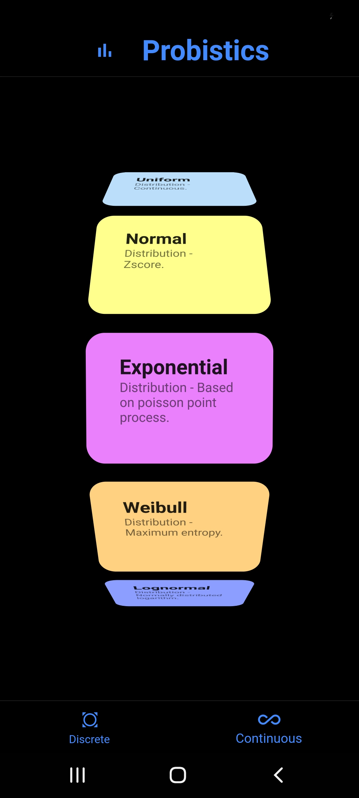
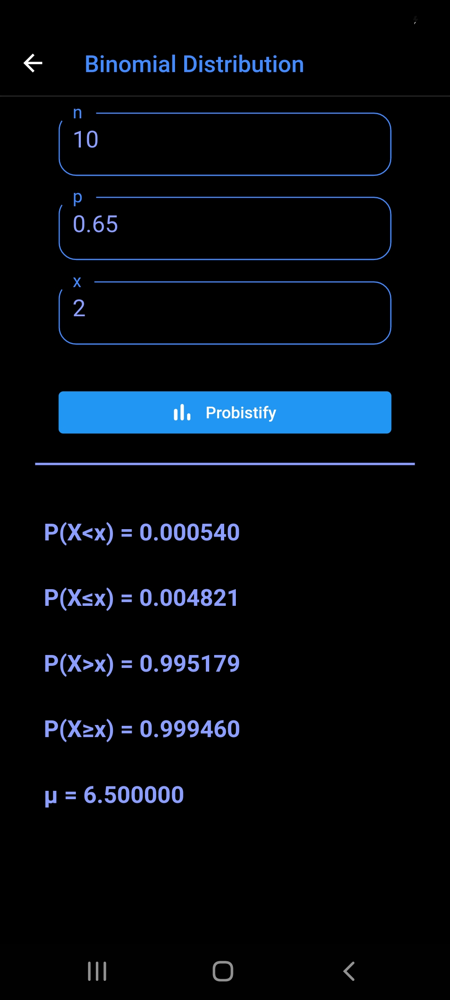
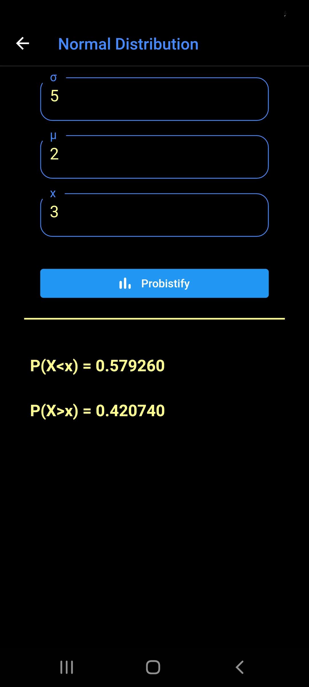

# Probistics


## Description
A flutter app for calculating continuous and discrete probability distributions. It calculates almost all scenarios of a distribution point. 

The distributions supported are as follows:

1. Discrete

   1.1 Uniform 

   1.2 Binomial

   1.3 Geometric I (K-Failures)

   1.4 Geometric II (K-Trials)

   1.5 Hypergeometric

   1.6 Negative Binomial

   1.7 Poisson

2. Continuous

    2.1 Uniform

    2.2 Normal

    2.3 Exponential

    2.4 Weibull

    2.5 Lognormal

For statistics, it supports mean, variance, and standard deviation for eligible distributions.


## Screenshots and App Demo
<details>
   <summary>Click to expand!</summary>

   

   

   

   

   


</details>

## Installation and Usage
<details>
   <summary>Click to expand!</summary>

   - Make sure you have flutter and dart sdk installed and setup.
   - Download/clone this repository. Then open terminal (make sure you are in the project's directory).
   - Run ````flutter devices```` and select which device you want to run it on. It is always better to run an app on your physical device. 

   > **Note:** *This app is not a production level app as it is my first app in flutter. However, it will help you with your homeworks and online quizzes and tests (if any) :) in a STAT course*.


</details>
